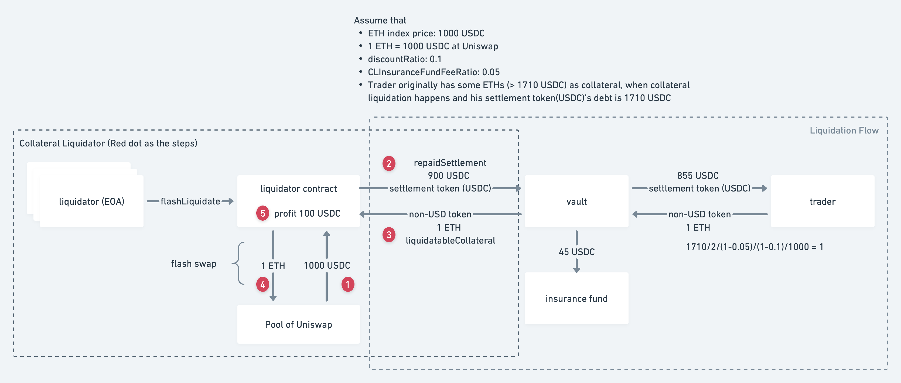

# Perp Collateral Liquidator

* Support collateral liquidation through curve and uniswap without any capital
* Collateral liquidation profits in settlement token (USDC)
* Access Control
    * Contract owner can withdraw fund (USDC) from the contract and do liquidation
    * Whitelisted EOA can liquidate through the contract to liquidate more efficiently



### Requirements

You should have Node v16 installed. Use [nvm](https://github.com/nvm-sh/nvm) to install it.

```
npm i
npm run build
```

### Deploy Contract

Prerequisite:
1. duplicate `.env.build.example`
2. rename it to `.env.build`
3. fill all of the fields
4. change contract owner or whitelisted EOA if needed from `deploy/001-deploy-liquidator.ts`

> ℹ️ Note for .env parameters
> 
> `MAX_SETTLEMENT_TOKEN_SPENT` is denominated in USDC. If your liquidation claim exceeds the amount available (e.g. due to another liquidator claiming part or all of the collateral faster than you), your transaction will fail. Setting a lower limit lets you claim a smaller amount and may increase your chances of success.

To deploy the contract:

```bash
# to Optimism Kovan (testnet)
npm run deploy-contract-optimism-kovan

# to Optimism (mainnet)
npm run deploy-contract-optimism
```

### Run App

Prerequisite:
1. duplicate `.env.runtime.example`
2. rename it to `.env.runtime.optimism` (or `.env.runtime.optimism-kovan` for testnet)
3. fill all of the fields
4. setup the swap path at `src/metadata.ts` to deal with the non-USD collateral (to flash loan/swap from a specific pool)

```bash
# build contract
npm run build

# on Optimism Kovan (testnet)
npm run start:optimism-kovan

# on Optimism (mainnet)
npm run start:optimism
```

---

### Development

```bash
npm i
npm run build

# on Optimism Kovan (testnet)
npm run app:optimism-kovan

# on Optimism (mainnet)
npm run app:optimism
```

### Testing

To run all the test cases:

```bash
npm run test
```


---

> If any features/functionalities described in the Perpetual Protocol documentation, code comments, marketing, community discussion or announcements, pre-production or testing code, or other non-production-code sources, vary or differ from the code used in production, in case of any dispute, the code used in production shall prevail.
